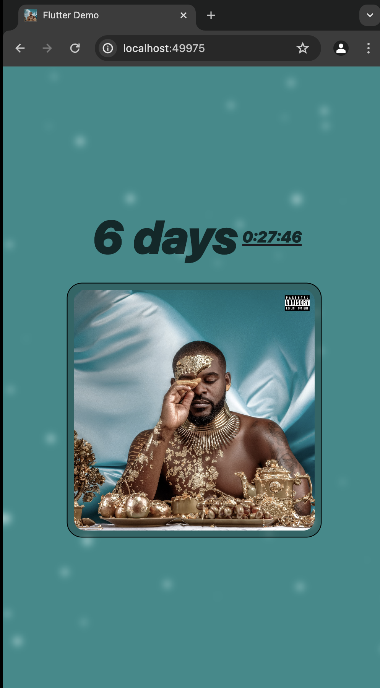

# FalzTheBahdGuy Countdown App

A new Flutter project developed based on Hacksultan's post on X (formerly Twitter). The app provides a countdown to the launch date of FalzTheBahdGuy's EP.




## Getting Started

This project is a starting point for a Flutter application.

A few resources to get you started if this is your first Flutter project:

- [Lab: Write your first Flutter app](https://docs.flutter.dev/get-started/codelab)
- [Cookbook: Useful Flutter samples](https://docs.flutter.dev/cookbook)

For help getting started with Flutter development, view the
[online documentation](https://docs.flutter.dev/), which offers tutorials,
samples, guidance on mobile development, and a full API reference.

## Project Inspiration

The project idea was inspired by a post from Hacksultan on X (formerly Twitter):

> Techiesssss :
>
> Build a web countdown for
> @falzthebahdguy
> ’s EP launch date.  
> Host anywhere. Drop url…. Let’s see the best countdown…….
>
> RT if you’re in🤝🤝🤝
> Quote
> Bop Daddy

[Link to the post](https://x.com/hackSultan/status/1796288974043873418)

## Live Demo

Check out the live demo of the app on Vercel: [FalzTheBahdGuy Countdown App](https://beforedfeast-7ahmfpvzc-nwakanma-dominion-chinonsos-projects.vercel.app)

## Screenshots


## Features

- Countdown timer to the EP launch date.
- Responsive design for both desktop and mobile views.
- Background animations with particles.
- Image of FalzTheBahdGuy.

## Installation

1. **Clone the repository:**

   ```bash
   git clone https://github.com/yourusername/falzthebahdguy_countdown.git
   cd falzthebahdguy_countdown

   ```

2. **Install dependencies:**

   ```bash
   flutter pub get

   ```

3. **Run the app:**
   ```bash
   flutter run
   ```

## Contributing

If you would like to contribute to this project, please follow these steps:

1. Fork the repository.
2. Create a new branch: `git checkout -b feature-branch-name`.
3. Make your changes and commit them: `git commit -m 'Add some feature'`.
4. Push to the branch: `git push origin feature-branch-name`.
5. Open a pull request.

Alternatively, you can open an issue if you find a bug or have a feature request.

## License

This project is licensed under my surveillance, I fit make am private tomorrow. I fit sue you too, if you go clone am. But every thing dey okay, no fear.

## Acknowledgements

Special thanks to Hacksultan for the inspiration and to the Flutter community for the support and resources.

## Contact

For any inquiries or feedback, please contact [immadominion@gmail.com](mailto:your-email@example.com).
